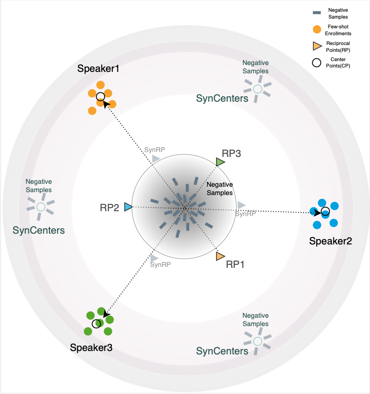
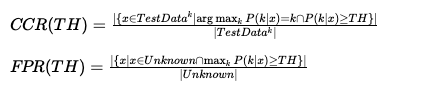

# Enhancing Open-Set Speaker Identification through Rapid Tuning with Speaker Reciprocal Points and Negative Samples

## Overview
We introduces a novel framework for open-set speaker identification in household environments, playing a crucial role in facilitating seamless human-computer interactions. Addressing the limitations of current speaker models and classification approaches, our work integrates an AudioLM frontend with a few-shot rapid tuning neural network (NN) backend for enrollment, employing task-optimized Speaker Reciprocal Points Learning (SRPL) to enhance discrimination across multiple target speakers. Furthermore, we propose an enhanced version of SRPL (SRPL+), which incorporates negative sample learning with both speech-synthesized and real negative samples to significantly improve open-set SID accuracy. Our approach is thoroughly evaluated across various multi-language datasets, demonstrating its effectiveness in achieving high usability for complex household multi-speaker scenarios and significantly enhancing open-set performance.

  

  

## Dataset
We utilize two primary datasets in our research:

- **Qualcomm Speech**:

[Link to Qualcomm Speech dataset](https://developer.qualcomm.com/project/keyword-speech-dataset)

| Target Spk | Unknown Spk | N-fold |
|----------|----------|----------|
| Row 1, Cell 1 | Row 1, Cell 2 | 3 |
| Row 2, Cell 1 | Row 2, Cell 2 | 3 |
| Row 3, Cell 1 | Row 3, Cell 2 | 3 |

- **FFSVC HiMia**:

[Link to HiMia dataset](https://aishelltech.com/wakeup_data)

| Column 1 | Column 2 | Column 3 |
|----------|----------|----------|
| Row 1, Cell 1 | Row 1, Cell 2 | Row 1, Cell 3 |
| Row 2, Cell 1 | Row 2, Cell 2 | Row 2, Cell 3 |
| Row 3, Cell 1 | Row 3, Cell 2 | Row 3, Cell 3 |

## Pretrained Audio Large Model
Our methodology is built upon a pretrained audio large model WavLM-base-plus for TDNN speaker verification, specifically designed to capture the nuances of human speech and speaker characteristics. This model serves as the foundation for our rapid tuning process, allowing for effective speaker identification.

[Link and Details to the pretrained WavLM-TDNN AudioLM](https://huggingface.co/microsoft/wavlm-base-plus-sv)

  

## Evaluations
The evaluation section details the performance metrics on open-set speaker identification. The Open Set Classification Rate (OSCR) calculates the area under the curve mapping the Correct Classification Rate (CCR) for known classes to the False Positive Rate (FPR) for unknown data, offering a threshold-independent evaluation for open-set.

<!-- $CCR(TH) = \frac{|\{x \in TestData^{k} \mid \arg\max_{k} P(k|x) = k \cap P(k|x) \geq TH\}|}{|TestData^{k}|}$

$FPR(TH) = \frac{|\{x \mid x \in Unknown \cap \max_k P(k|x) \geq TH\}|}{|Unknown|}$ -->

We provide this core evaluation metrics implementaion with other evaluation metrics in our code repository.

[Evaluation metrics implementation](https://github.com/srplplus/srplplus.github.io)

## Code
Code used in this research for model training, and evaluation, is available for public use after publication. This encourages reproducibility and further experimentation in the field.

**Please note**: The models, saved checkpoints, and evaluation code for reproducing results are now available. However, the training code for SRPL+ will be **released after the publication** of our research paper.

[SRPL+ code repository](https://github.com/srplplus/srplplus.github.io)

## Visualization and Evaluations
We present a series of visualizations and detailed evaluations to illustrate our method's effectiveness. The embedding plots clearly demostrate the effectiveness of our method.

<!-- [Link to visualizations and detailed evaluations]() -->

<!-- ## How to Use
This section provides a step-by-step guide on how to replicate our research findings, including setting up the environment, preprocessing the data, training the model, and conducting evaluations. -->

## Citation
Please cite our work if it contributes to your research:

@article{srplplus2024,
title={Enhancing Open-Set Speaker Identification through Rapid Tuning with Speaker Reciprocal Points and Negative Samples},
author={Anonymous Authors},
journal={Anonymous Journal},
year={2024},
publisher={Anonymous Publisher}
}
